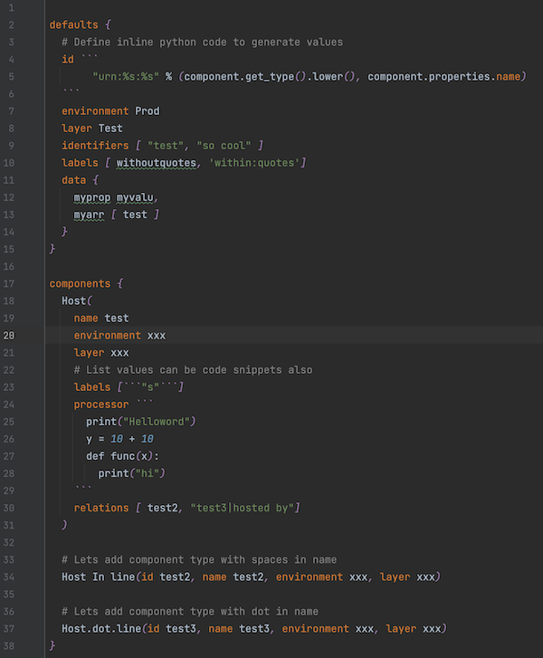
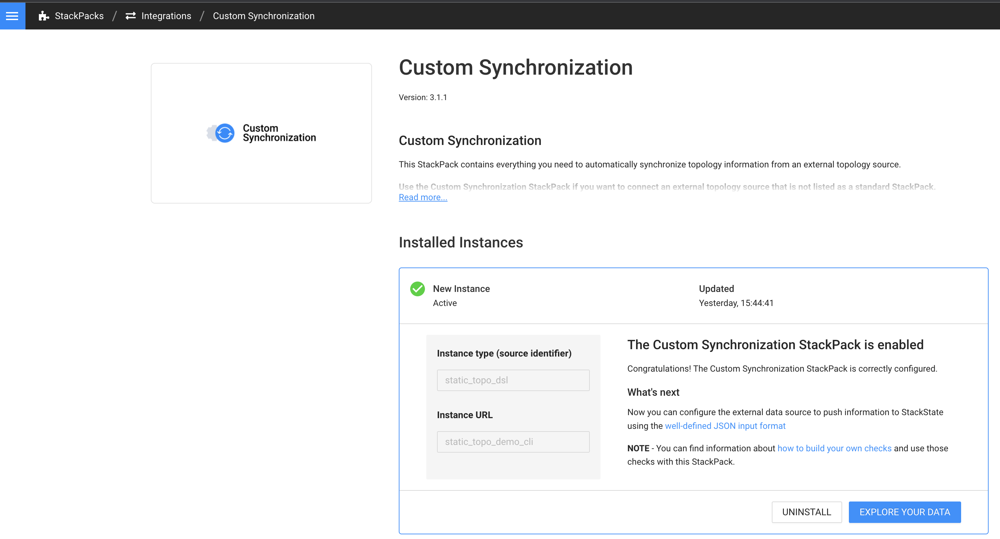
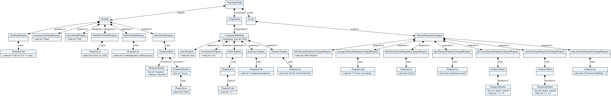

# StackState Static Topology DSL

## Overview

StackState Static Topology DSL allows you to easily define components, relations and health
in `.topo` files using a ___Topology Language___.





The topology can be sent to the StackState server via a CLI or configured as an Agent Check.

Syntax highlighting of `.topo` files can be done in VSCode, Intellij or any other text editor that supports TextMate Bundles.

## Topology Language

The Topology language is a mix between component configuration and dynamic python snippets.


### Structure of `.topo` file

```
defaults {
   ...
}

components {
   ...
}
```
Components are defined in the `components` section.  Any component property can also be defined in the defaults sections.

### Component Properties

| Name          | Type   | Comments                                    | 
|---------------|--------|---------------------------------------------|
| id            | string |                                             |
| name          | string |                                             |
| layer         | string |                                             |
| domain        | string |                                             |
| labels        | list   |                                             |
| identifiers   | list   |                                             |
| health        | string | Valid values are CRITICAL, DEVIATING, CLEAR |
| healthMessage | string |                                             |

### Property types

- `string` can be defined with optional single or double quotes.
- `float` 
- `int` 
- `boolean`
- `map` defined as `{ property: value, property: value}` where `value` can be any property type
- `list` defined as `[value, value]` where `value` can be any property type
- `code` is a snippet of python code.  Defined as  \``` code \```

### Code snippets

Code snippets can be used for any component property to generate the value.
The python code is interpreted with [asteval](https://newville.github.io/asteval/).
The code will have access to a `factory` object. This can be used to query for other components or create components 
programmatically. The `component` object represents the current component being created.

### `processor` Code Property

Define a `processor` property on the component or in the `defaults` as a code snippet.
Easier to programmatically manipulate the component for complex processing.

### Comments

Comments are support in the form of `#`
### Defaults Section

Any list type (labels, relations, identifiers) or map type (data) properties are merged with the component in the components section. 
For all other properties, if they are defined on the component, the default is ignored. 


### Components Section

A component is defined by first entering the component type followed by opening brackets `(`.
Define the properties and close with a closing bracket `)`

### Sample `.topo`

See [sample.topo](./tests/resources/share/topologies/sample.topo)

## Installation

This package can be used as a standalone cli or as an agent check.

### Requirements

- Python v.3.7+. See [Python installation guide](https://docs.python-guide.org/starting/installation/)
- virtualenv. See [Pipenv & Virtual Environments guide](https://docs.python-guide.org/dev/virtualenvs/)
- [Custom Synchronization StackPack](https://docs.stackstate.com/stackpacks/integrations/customsync)

### Custom Synchronization StackPack

On the StackState server create an instance of the StackPack similar to: 



### Create a virtual environment

On your local machine setup a virtual environment
```bash
$ # Install virtual env
$ pip install virtualenv
$ virtualenv --version
$ # Create a virtual environment in a directory of your choosing 
$ cd project_folder
$ virtualenv venv
$ source venv/bin/activate
$ pip install six requests
```

### Install `ststopo` CLI 


```bash
python -m pip install https://github.com/stackstate-lab/static-topology-dsl-integration/releases/download/0.1.0/sts_static_topology-0.1.0-py2.py3-none-any.whl
```

The `ststopo` command-line utility reads `.topo` files specified in the `conf.yaml` and sends the resulting Components, Relations and Health to StackState.

```bash
$ ststopo --help
Usage: ststopo [OPTIONS]

Options:
  -f, --conf  TEXT  Configuration yaml file
  --log-level TEXT  Log Level
  --dry-run         Dry run static topology creation
  --work-dir  TEXT  Set the current working directory
  --help            Show this message and exit.
```

Create a `conf.yaml` similar to the one below. Remember to change the `receiver_url` and `api_key`

```yaml

stackstate:
  receiver_url: https://<your stackstate server>/receiver
  api_key: xxxxx
  #  use as the source identifier and url in StackState integrations when creating a Custom Synchronzation instance.
  instance_type: static_topo_dsl
  instance_url: static_topo_demo_cli
  health_sync:
    source_name: static_health
    stream_id: "static_health_topo"   # unique id representing this stream instance
    expiry_interval_seconds: 2592000  # 30 Days
    repeat_interval_seconds: 1800     # 30 Minutes
  internal_hostname: localhost

topo_files:
  - ./share/topologies    # can be a directory
```

Create a sample topology and dry run to see resulting Components, Relations and Health
You can copy [sample.topo](./tests/resources/share/topologies/sample.topo) to `./share/topologies`

```bash
$ mkdir -p ./share/topologies
$ curl -L https://raw.githubusercontent.com/stackstate-lab/static-topology-dsl-integration/master/tests/resources/share/topologies/sample.topo -o ./share/topologies/sample.topo
$ ststopo --dry-run   
```
<details>
<summary>
Expand to see output
</summary>

```bash
Loading configuration from ./conf.yaml
Running Static Topology sync in dry-run mode
2022.05.06 10:16:51 - root (27) - INFO: Processing './share/topologies/sample.topo'
Discovered Component and Relation information:
--------------------------------------------------------------------------------
{
    "apiKey": "xxxx",
    "collection_timestamp": 1651832211.193224,
    "internalHostname": "localhost",
    "events": {},
    "metrics": [],
    "service_checks": [],
    "health": [],
    "topologies": [
        {
            "start_snapshot": true,
            "stop_snapshot": true,
            "instance": {
                "type": "static_topo_dsl",
                "url": "static_topo_demo_cli"
            },
            "delete_ids": [],
            "components": [
                {
                    "externalId": "urn:host:test10",
                    "type": {
                        "name": "host"
                    },
                    "data": {
                        "name": "test10",
                        "layer": "Machines",
                        "domain": "StaticTopology",
                        "environment": "Prod",
                        "labels": [
                            "static:test",
                            "staticdemo"
                        ],
                        "identifiers": [
                            "urn:host:test10"
                        ],
                        "custom_properties": {
                            "myprop": "myvalue",
                            "myarr": [
                                "test"
                            ]
                        }
                    },
                    "relations": []
                },
                {
                    "externalId": "urn:host:test12",
                    "type": {
                        "name": "host"
                    },
                    "data": {
                        "name": "test12",
                        "layer": "Machines",
                        "domain": "StaticTopology",
                        "environment": "Prod",
                        "labels": [
                            "staticdemo"
                        ],
                        "identifiers": [
                            "urn:host:test12"
                        ],
                        "custom_properties": {
                            "myprop": "myvalue",
                            "myarr": [
                                "test"
                            ]
                        }
                    },
                    "relations": []
                }
            ],
            "relations": [
                {
                    "externalId": "urn:host:test10 --> urn:host:test12",
                    "type": {
                        "name": "uses"
                    },
                    "sourceId": "urn:host:test10",
                    "targetId": "urn:host:test12",
                    "data": {
                        "labels": []
                    }
                }
            ]
        }
    ]
}
--------------------------------------------------------------------------------
{
    "apiKey": "xxxxx",
    "collection_timestamp": 1651832211.194588,
    "internalHostname": "localhost",
    "events": {},
    "metrics": [],
    "service_checks": [],
    "health": [
        {
            "start_snapshot": {
                "expiry_interval_s": 2592000,
                "repeat_interval_s": 1800
            },
            "stop_snapshot": {},
            "stream": {
                "urn": "urn:health:static_health:static_health_topo",
                "sub_stream_id": null
            },
            "check_states": [
                {
                    "checkStateId": "test10_static_states",
                    "name": "HealthCheck",
                    "topologyElementIdentifier": "urn:host:test10",
                    "message": "",
                    "health": "CLEAR"
                },
                {
                    "checkStateId": "test12_static_states",
                    "name": "HealthCheck",
                    "topologyElementIdentifier": "urn:host:test12",
                    "message": "",
                    "health": "CLEAR"
                }
            ]
        }
    ],
    "topologies": []
}
--------------------------------------------------------------------------------
--------------------------------------------------------------------------------
Total Components = 2.
Total Relations = 1.
Total Health Syncs = 2.
--------------------------------------------------------------------------------
Done
```
</details>

To send to StackState run `ststopo`

### Agent Check

Download Static Topology DSL agent check [release](https://github.com/stackstate-lab/static-topology-dsl-integration/releases/download/v0.1.0/sts_static_topology-0.1.0.zip)
to the machine running the StackState Agent.

```bash
$ curl -o sts_static_topology-0.1.0.zip -L https://github.com/stackstate-lab/static-topology-dsl-integration/releases/download/0.1.0/sts_static_topology-0.1.0.zip
$ unzip ./sts_static_topology-0.1.0.zip
$ ./install.sh
$ cd /etc/stackstate-agent/conf.d/static_topology_dsl.d
$ cp ./conf.yaml.example ./conf.yaml
$ chown stackstate-agent:stackstate-agent ./conf.yaml
$ vi ./conf.yaml
```

Change the configuration to point to the location of your `.topo` files

```yaml
init_config:

instances:
  - instance_url: "static_topo_demo"
    min_collection_interval: 300
    topo_files:
      - /etc/stackstate-agent/share/topologies/
```

On the StackState server create an instance of the Custom Synchronization StackPack for the `instance_url`

### Syntax Highlighting

For VSCode, copy `./grammar/topo-vscode` to `~/.vscode/extensions`

For Intellij import the `./grammar/topo-tmbundle`. See [Textmate Bundles](https://www.jetbrains.com/help/idea/textmate.html)

## Development

### Topology grammar

The Topology language is defined in [topology.tx](./grammar/topology.tx) using [Textx](https://textx.github.io/textX/3.0/) meta-language

Visualization of the model [topoloy.topo](./grammar/topology.topo)

