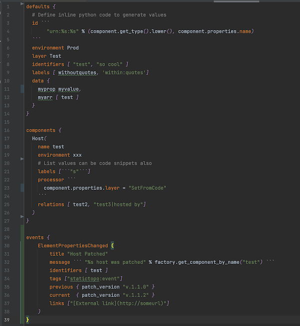

# StackState Static Topology DSL

## Overview

StackState Static Topology DSL allows you to easily define components, relations and health
in `.topo` files using a ___Topology Language___.





The topology can be sent to the StackState server via a CLI or configured as an Agent Check.

Syntax highlighting of `.topo` files can be done in VSCode, Intellij or any other text editor that supports TextMate Bundles.

## Topology Language

The Topology language is a mix between component configuration and dynamic python snippets.


### Structure of `.topo` file

```
defaults {
   ...
}

components {
   ...
}
```
Components are defined in the `components` section.  Any component property can also be defined in the defaults sections.

### Component Properties

| Name          | Type   | Comments                                    | 
|---------------|--------|---------------------------------------------|
| id            | string |                                             |
| name          | string |                                             |
| layer         | string |                                             |
| domain        | string |                                             |
| labels        | list   |                                             |
| identifiers   | list   |                                             |
| health        | string | Valid values are CRITICAL, DEVIATING, CLEAR |
| healthMessage | string |                                             |

### Property types

- `string` can be defined with optional single or double quotes.
- `float` 
- `int` 
- `boolean`
- `map` defined as `{ property: value, property: value}` where `value` can be any property type
- `list` defined as `[value, value]` where `value` can be any property type
- `code` is a snippet of python code.  Defined as  \``` code \```

### Code snippets

Code snippets can be used for any component property to generate the value.
The python code is interpreted with [asteval](https://newville.github.io/asteval/).
The code will have access to a `factory` object. This can be used to query for other components or create components 
programmatically. The `component` object represents the current component being created.

### `processor` Code Property

Define a `processor` property on the component or in the `defaults` as a code snippet.
Easier to programmatically manipulate the component for complex processing.

### Comments

Comments are support in the form of `#`
### Defaults Section

Any list type (labels, relations, identifiers) or map type (data) properties are merged with the component in the components section. 
For all other properties, if they are defined on the component, the default is ignored. 


### Components Section

A component is defined by first entering the component type followed by opening brackets `(`.
Define the properties and close with a closing bracket `)`


## Installation

This package can be used as a standalone cli or as an agent check.


### Agent Check
### CLI
### Syntax Highlighting